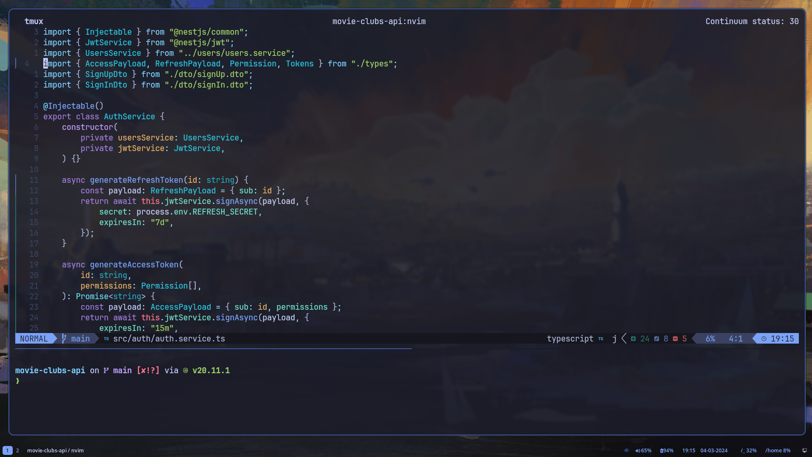

# nvim/



# nvim/

<a href="https://dotfyle.com/msyavuz/nvim"></a>
<a href="https://dotfyle.com/msyavuz/nvim"></a>
<a href="https://dotfyle.com/msyavuz/nvim"></a>


## Install Instructions

 > Install requires Neovim 0.9+. Always review the code before installing a configuration.

Clone the repository and install the plugins:

```sh
git clone git@github.com:msyavuz/nvim ~/.config/msyavuz/nvim
NVIM_APPNAME=msyavuz/nvim/ nvim --headless +"Lazy! sync" +qa
```

Open Neovim with this config:

```sh
NVIM_APPNAME=msyavuz/nvim/ nvim
```

## Plugins

### colorscheme

+ [folke/tokyonight.nvim](https://dotfyle.com/plugins/folke/tokyonight.nvim)
### comment

+ [folke/todo-comments.nvim](https://dotfyle.com/plugins/folke/todo-comments.nvim)
### completion

+ [hrsh7th/nvim-cmp](https://dotfyle.com/plugins/hrsh7th/nvim-cmp)
### diagnostics

+ [folke/trouble.nvim](https://dotfyle.com/plugins/folke/trouble.nvim)
### editing-support

+ [debugloop/telescope-undo.nvim](https://dotfyle.com/plugins/debugloop/telescope-undo.nvim)
+ [folke/zen-mode.nvim](https://dotfyle.com/plugins/folke/zen-mode.nvim)
+ [nvim-treesitter/nvim-treesitter-context](https://dotfyle.com/plugins/nvim-treesitter/nvim-treesitter-context)
+ [echasnovski/mini.move](https://dotfyle.com/plugins/echasnovski/mini.move)
+ [windwp/nvim-ts-autotag](https://dotfyle.com/plugins/windwp/nvim-ts-autotag)
+ [echasnovski/mini.pairs](https://dotfyle.com/plugins/echasnovski/mini.pairs)
### file-explorer

+ [stevearc/oil.nvim](https://dotfyle.com/plugins/stevearc/oil.nvim)
### formatting

+ [stevearc/conform.nvim](https://dotfyle.com/plugins/stevearc/conform.nvim)
### fuzzy-finder

+ [nvim-telescope/telescope.nvim](https://dotfyle.com/plugins/nvim-telescope/telescope.nvim)
### git

+ [kdheepak/lazygit.nvim](https://dotfyle.com/plugins/kdheepak/lazygit.nvim)
+ [lewis6991/gitsigns.nvim](https://dotfyle.com/plugins/lewis6991/gitsigns.nvim)
### icon

+ [nvim-tree/nvim-web-devicons](https://dotfyle.com/plugins/nvim-tree/nvim-web-devicons)
### keybinding

+ [folke/which-key.nvim](https://dotfyle.com/plugins/folke/which-key.nvim)
### lsp

+ [smjonas/inc-rename.nvim](https://dotfyle.com/plugins/smjonas/inc-rename.nvim)
+ [neovim/nvim-lspconfig](https://dotfyle.com/plugins/neovim/nvim-lspconfig)
+ [onsails/lspkind.nvim](https://dotfyle.com/plugins/onsails/lspkind.nvim)
+ [zeioth/garbage-day.nvim](https://dotfyle.com/plugins/zeioth/garbage-day.nvim)
+ [mfussenegger/nvim-lint](https://dotfyle.com/plugins/mfussenegger/nvim-lint)
+ [mfussenegger/nvim-jdtls](https://dotfyle.com/plugins/mfussenegger/nvim-jdtls)
### lsp-installer

+ [williamboman/mason.nvim](https://dotfyle.com/plugins/williamboman/mason.nvim)
### marks

+ [cbochs/grapple.nvim](https://dotfyle.com/plugins/cbochs/grapple.nvim)
### motion

+ [ggandor/flit.nvim](https://dotfyle.com/plugins/ggandor/flit.nvim)
+ [ggandor/leap.nvim](https://dotfyle.com/plugins/ggandor/leap.nvim)
### nvim-dev

+ [kkharji/sqlite.lua](https://dotfyle.com/plugins/kkharji/sqlite.lua)
+ [nvim-lua/plenary.nvim](https://dotfyle.com/plugins/nvim-lua/plenary.nvim)
+ [folke/neodev.nvim](https://dotfyle.com/plugins/folke/neodev.nvim)
+ [folke/lazydev.nvim](https://dotfyle.com/plugins/folke/lazydev.nvim)
### plugin-manager

+ [folke/lazy.nvim](https://dotfyle.com/plugins/folke/lazy.nvim)
### snippet

+ [L3MON4D3/LuaSnip](https://dotfyle.com/plugins/L3MON4D3/LuaSnip)
+ [rafamadriz/friendly-snippets](https://dotfyle.com/plugins/rafamadriz/friendly-snippets)
### split-and-window

+ [echasnovski/mini.bufremove](https://dotfyle.com/plugins/echasnovski/mini.bufremove)
### statusline

+ [nvim-lualine/lualine.nvim](https://dotfyle.com/plugins/nvim-lualine/lualine.nvim)
### syntax

+ [echasnovski/mini.surround](https://dotfyle.com/plugins/echasnovski/mini.surround)
+ [nvim-treesitter/nvim-treesitter-textobjects](https://dotfyle.com/plugins/nvim-treesitter/nvim-treesitter-textobjects)
+ [nvim-treesitter/nvim-treesitter](https://dotfyle.com/plugins/nvim-treesitter/nvim-treesitter)
## Language Servers

+ angularls
+ astro
+ bashls
+ cssls
+ dockerls
+ elixirls
+ eslint
+ gopls
+ html
+ jdtls
+ jsonls
+ lua_ls
+ pyright
+ svelte
+ tailwindcss
+ tsserver


 This readme was generated by [Dotfyle](https://dotfyle.com)
